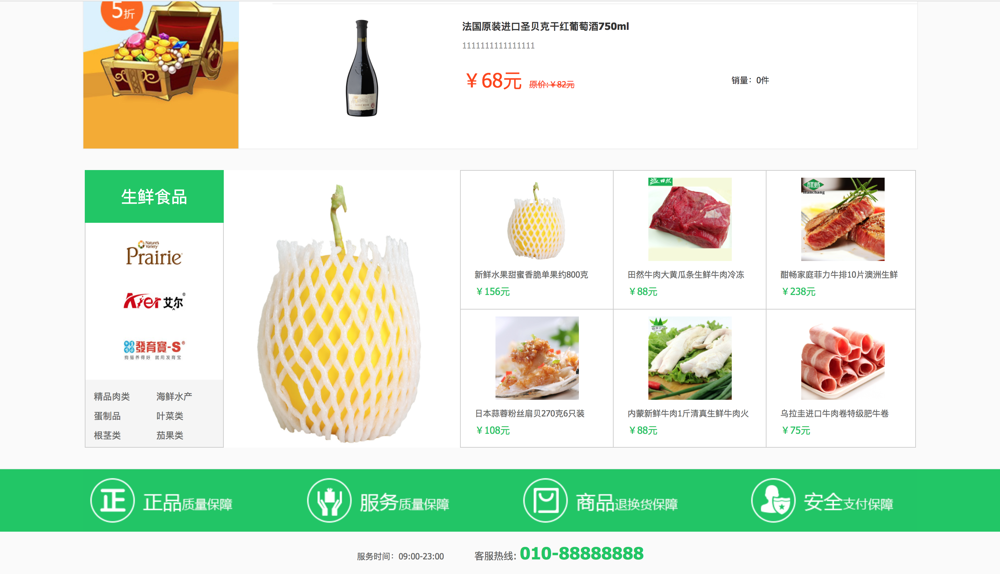
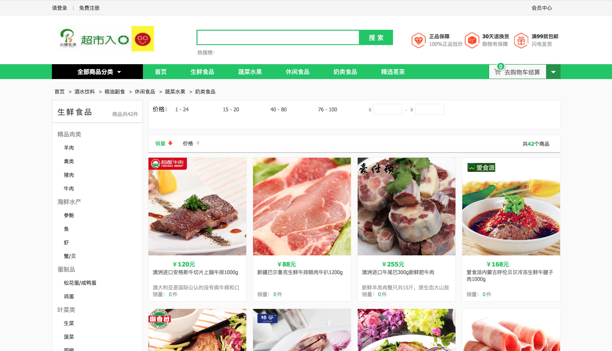
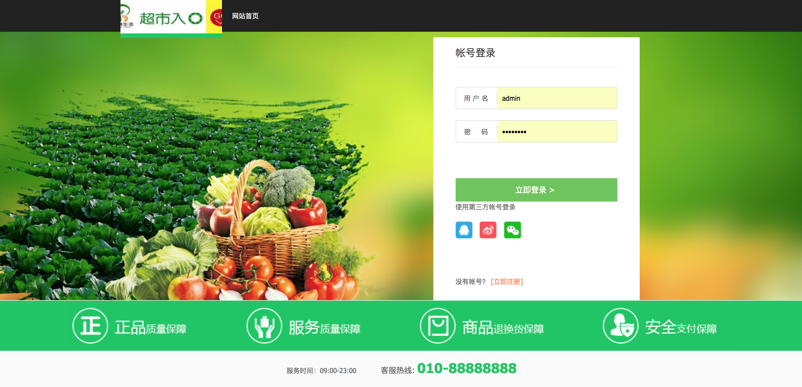
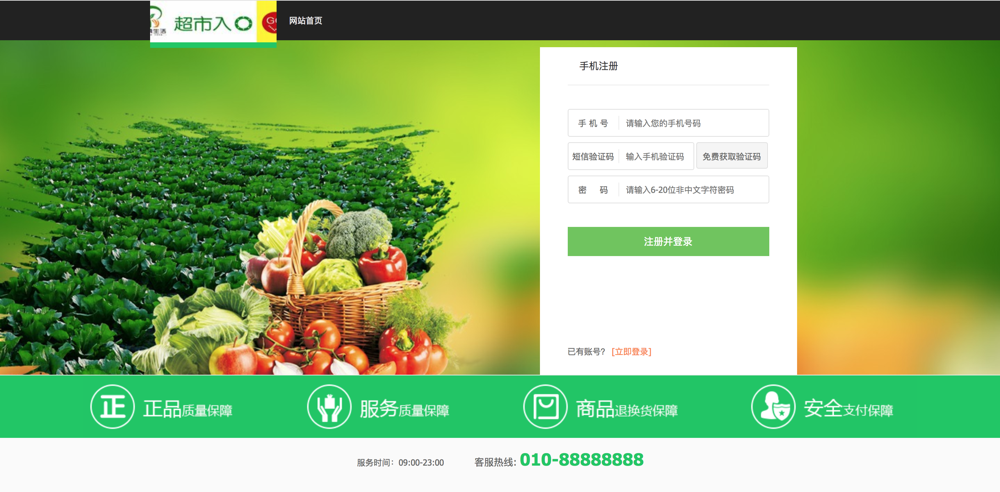
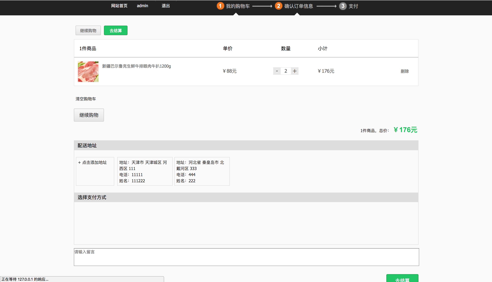
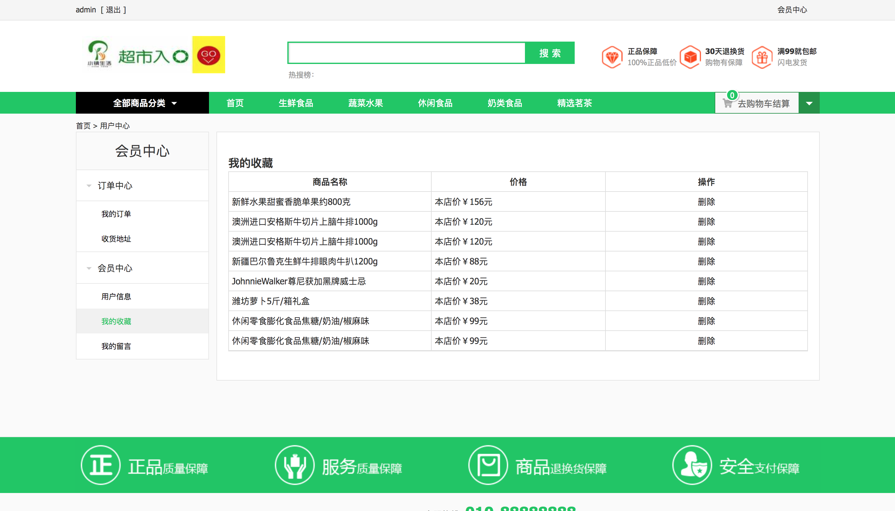

1.项目说明
-------
>在线电商系统，使用```Django_rest_framework```与```vue```进行前后端分离，集成第三方微博，QQ, 微信的登陆，和支付宝的支付，项目是我跟着慕学网的课程做的，非常感谢暮学网```bobby```老师，让我在这个课程中学到了很多的内容！

2.项目使用到的第三方包
-----------------
>django<br />
>pillow<br />
>mysqlclient<br />
>djangorestframework-jwt<br />
>djangorestframework<br />
>markdown<br />
>django-filter<br />
>django-crispy-forms<br />
>django-reversion<br />
>django-formtools<br />
>future<br />
>httplib2<br />
>six<br />
>requests<br />
>coreapi<br />
>django-cors-headers<br />
>xlwt<br />
>xlsxwriter<br />
>drf-extensions<br />
>django-redis<br />
>pycryptodome<br />
>raven<br />
>social-auth-app-django<br />
<br />

3.配置和启动
---------
>1.如果阁下没有安装上面我所说到的环境，请阁下自行安装。

>3.安装环境后请修改```/MxShop/MxShop/```目录下的```settings.py```文件里面的DATABASES数据库，短信，支付宝，第三方登陆的配置信息

>4.然后进入项目根目录执行:```python manage.py makemigrations```

>5.在执行：```python manage.py migrate```

>6.在建创后台管理员:```python manage.py createsuperuser ```

4.启动
------
>1.运行命令```python manage.py runserver```

>2.然后访问```http://127.0.0.1:8000```
>
>3.后台地址```http://127.0.0.1:8000/xadmin/```
>

5.前端文件
---------
>1.进入```online-store```目录
>
>2.执行```npm install```安装所需要的依赖
>
>ps: 如果觉得```npm```慢，可以安装cnpm代替，安装方法自行百度。
>
>3.安装完成后执行```npm run dev```运行前端项目
>
>4.访问地址：```http://127.0.0.1:8080/```
>

6.项目效果图
-----------




















